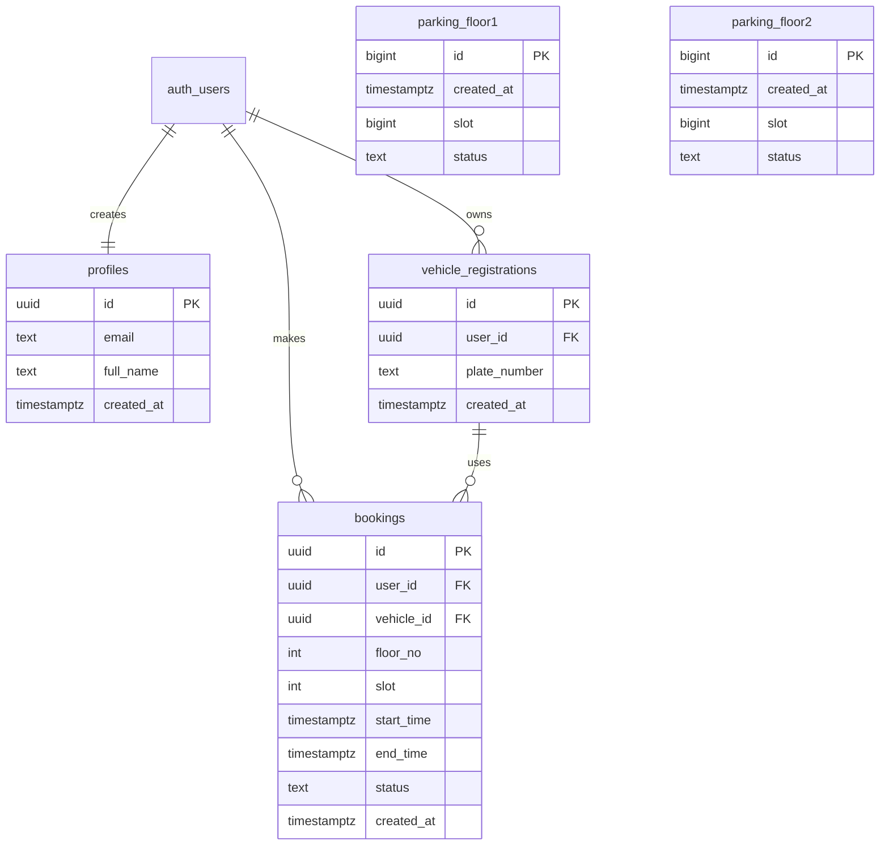

# EZP Schema Based On Your Old Tables

This version keeps your original tables:

- `parking_floor1`
- `parking_floor2`

and adds:

- `profiles`
- `vehicle_registrations`
- `bookings`

## Diagram

## How It Works

1. User signs up with Supabase Auth.
2. Trigger stores that user in `profiles`.
3. User registers car plate in `vehicle_registrations`.
4. User books a slot and time in `bookings`.
5. Booking is allowed only on floor 2.
6. `parking_floor1` and `parking_floor2` keep sensor/live slot status history from your old design.
7. Barrier logic checks plate + slot + current time against `bookings`.

## Meaning Of Old Tables

- `parking_floor1`: live or history records for floor 1 slot status
- `parking_floor2`: live or history records for floor 2 slot status

These old tables do not store which user booked the slot.
That is why `bookings` is needed.

## Recommended Link Rule

Use this rule in your app:

- `bookings.floor_no = 1` means booking is for `parking_floor1`
- `bookings.floor_no = 2` means booking is for `parking_floor2`
- `bookings.slot` matches the `slot` column in those floor tables

## Barrier Rule

Only floor 2 bookings can open the barrier.

The camera/barrier should call:

- `validate_barrier_entry(plate_number, 2, slot, now())`

If the result returns:

- `allowed = true`
- `reason = 'ALLOW'`

then open the barrier.

## SQL File

Use this SQL file for the old-table version:

[supabase-schema-current-floors.sql](/C:/Users/saowa/Downloads/ezp-parking-backend-main/ezp-parking-backend-main/supabase-schema-current-floors.sql)
