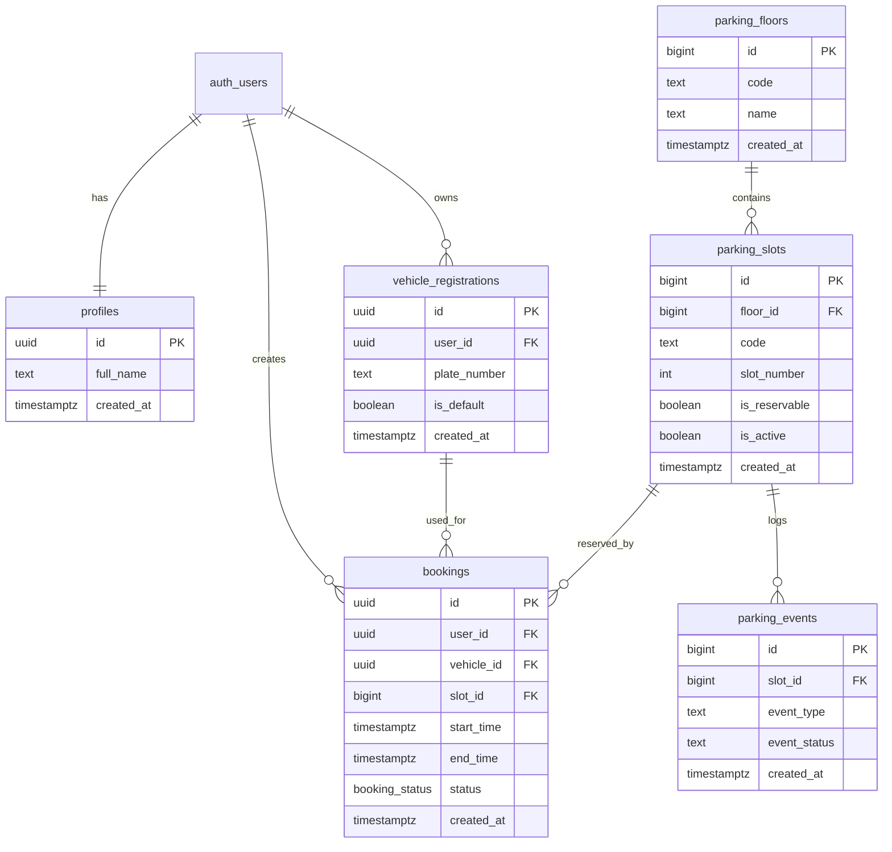

# EZP Supabase Schema Overview

## Register flow

1. User signs up with Supabase Auth.
2. `profiles` row is created automatically by trigger.
3. Car plates are saved to `vehicle_registrations`.
4. Optional slot booking is created in `bookings` through `create_booking(...)`.
5. `create_booking(...)` blocks overlapping reservations for the same slot and time range.
